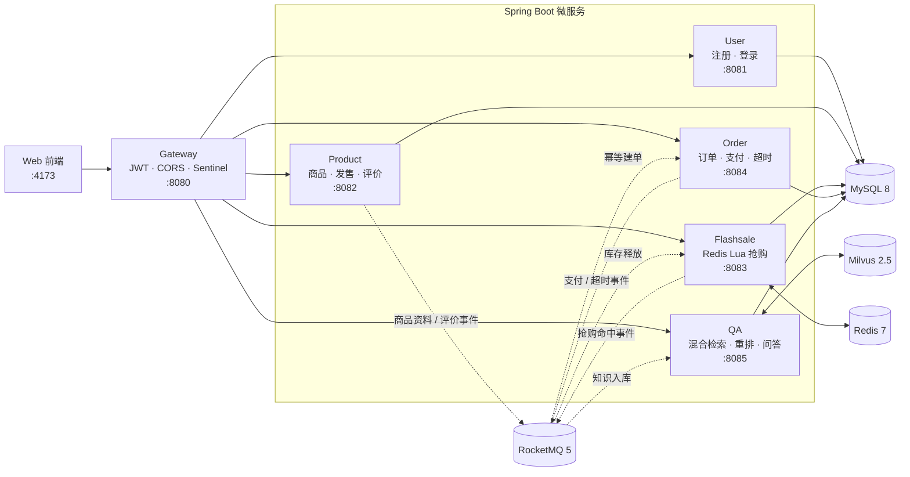
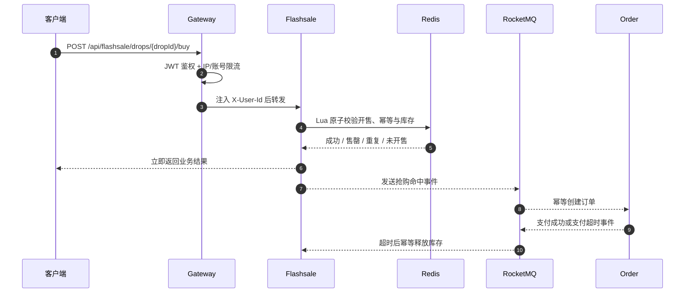
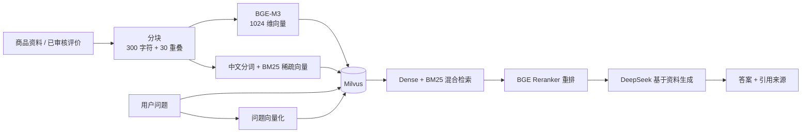

# ⚡ 高并发限量消费平台与 RAG 知识库

基于 **Spring Boot 3**、**Redis Lua**、**RocketMQ**、**Milvus** 与 **DeepSeek** 构建的限量消费平台。系统面向集中流量下的库存一致性、重复购买和服务削峰问题，并通过 RAG 将商品资料与真实评价组织为可检索、可重排、可追溯的 AI 知识库。

## ✨ 功能特性

| 模块 | 说明 |
|---|---|
| ⚡ 高并发抢购 | Redis 预热库存，Lua 脚本在一次原子操作中完成开售校验、用户幂等和库存扣减，避免超卖与重复购买 |
| 🛡 网关限流 | Spring Cloud Gateway 统一路由、JWT 鉴权和用户身份注入；Sentinel 按 IP 与账号维度限流，超限返回 HTTP 429 |
| 📦 订单履约 | 抢购成功后通过 RocketMQ 发送领域事件，订单服务幂等建单；支付超时自动关闭订单并释放库存 |
| 🧠 RAG 问答 | BGE-M3 生成 1024 维向量，Milvus 执行 Dense + BM25 混合检索，候选结果经 BGE Reranker 重排后交给 DeepSeek 作答 |
| 🔎 来源追溯 | 问答接口返回答案、原文片段、来源类型、来源 ID、检索分数与重排分数，支持核验回答依据 |
| 📝 知识入库 | 商品官方资料和审核通过的购买评价通过 RocketMQ 自动进入知识库；撤回评价时同步清理对应分块与向量 |
| 🖥 Web 界面 | 提供商品浏览、注册登录、实时库存、抢购、订单查询、模拟支付和商品知识问答 |
| 🧪 并发测试 | JMeter 覆盖库存不超卖、同用户并发幂等、递增并发、IP/账号限流、CSV 参数化和同步起跑 |

## 🏗 系统架构



### 高并发请求链路



### RAG 检索链路



## 🛠 技术栈

| 分类 | 技术 |
|---|---|
| 后端框架 | Spring Boot 3.4.4 · Java 17 · Spring Cloud Gateway |
| 持久层 | MyBatis-Plus 3.5.7 · MySQL 8 |
| 高并发组件 | Redis 7 · Lua · Sentinel 1.8.8 |
| 消息中间件 | RocketMQ 5.3 |
| 向量数据库 | Milvus 2.5（Dense + Sparse 混合检索） |
| 大模型 | DeepSeek `deepseek-chat` |
| Embedding | SiliconFlow `BAAI/bge-m3`（1024 维） |
| Reranker | SiliconFlow `BAAI/bge-reranker-v2-m3` |
| 测试与部署 | JUnit 5 · JMeter 5.6.x · Docker Compose |
| 前端 | HTML · CSS · JavaScript · Lucide Icons |

## 🚀 快速开始

### 1. 环境要求

- JDK 17+
- Maven 3.9+
- Docker Desktop
- Python 3（用于启动静态前端）
- DeepSeek API Key、SiliconFlow API Key（仅 RAG 问答需要）
- 可选：JMeter 5.6.x（用于并发测试）

### 2. 启动基础设施

```bash
docker compose up -d
docker compose ps
```

Docker Compose 会启动以下组件：

| 组件 | 本地端口 |
|---|---:|
| MySQL 8 | `3308` |
| Redis 7 | `6379` |
| RocketMQ NameServer | `9876` |
| RocketMQ Broker | `10909` / `10911` |
| Milvus | `19530` |
| MinIO | `9000` / `9001` |

首次启动时，`infra/mysql/init/` 会自动创建用户、商品、抢购、订单和 QA 数据库。

### 3. 配置 RAG API Key

PowerShell：

```powershell
$env:SILICONFLOW_API_KEY = "你的 SiliconFlow API Key"
$env:DEEPSEEK_API_KEY = "你的 DeepSeek API Key"
```

Linux / macOS：

```bash
export SILICONFLOW_API_KEY="你的 SiliconFlow API Key"
export DEEPSEEK_API_KEY="你的 DeepSeek API Key"
```

不要把真实 API Key 写入代码或提交到仓库。未配置密钥时，高并发抢购、订单等业务仍可独立运行。

### 4. 构建项目

```bash
mvn clean package -DskipTests
```

运行全部测试：

```bash
mvn test
```

### 5. 启动服务

在不同终端中依次运行：

```powershell
java -jar user/target/limited-drop-user-1.0.0-SNAPSHOT.jar
java -jar product/target/limited-drop-product-1.0.0-SNAPSHOT.jar
java -jar flashsale/target/limited-drop-flashsale-1.0.0-SNAPSHOT.jar
java -jar order/target/limited-drop-order-1.0.0-SNAPSHOT.jar
java -jar qa/target/limited-drop-qa-1.0.0-SNAPSHOT.jar
java -jar gateway/target/limited-drop-gateway-1.0.0-SNAPSHOT.jar
```

### 6. 启动 Web 前端

```bash
python -m http.server 4173 --directory frontend
```

浏览器打开 **http://localhost:4173**。前端默认通过 **http://localhost:8080** 访问 Gateway。

## 📁 项目结构

```text
.
├── common/       # 统一响应、JWT、Redis Key、MQ Topic 和领域事件
├── gateway/      # 路由、JWT、CORS、XFF 清洗和 Sentinel 限流
├── user/         # 用户注册、登录和身份查询
├── product/      # 商品、限量发售、购买评价和知识事件发布
├── flashsale/    # Redis 预热、Lua 原子抢购和库存释放
├── order/        # 幂等建单、订单查询、支付和超时检查
├── qa/           # 文档分块、Embedding、混合检索、重排和 DeepSeek 问答
├── frontend/     # 无构建步骤的 Web 前端
├── infra/        # MySQL 和 RocketMQ 初始化配置
├── loadtest/     # JMeter 并发测试计划、用户数据和运行脚本
├── scripts/      # 端到端冒烟与支付超时测试脚本
├── docs/adr/     # 关键架构决策记录
└── docker-compose.yml
```

## 📡 API 接口

业务接口统一通过 Gateway `http://localhost:8080` 访问，受保护接口使用 `Authorization: Bearer <JWT>`。

### 用户与商品

| 方法 | 路径 | 说明 | 鉴权 |
|---|---|---|---|
| POST | `/api/user/auth/register` | 注册并返回 JWT | 公开 |
| POST | `/api/user/auth/login` | 登录并返回 JWT | 公开 |
| GET | `/api/user/me` | 查询当前用户 | JWT |
| GET | `/api/product/products` | 商品列表 | 公开 |
| GET | `/api/product/products/{id}` | 商品详情 | 公开 |
| GET | `/api/product/drops` | 限量发售列表 | 公开 |
| GET | `/api/product/products/{productId}/reviews` | 已发布评价 | 公开 |

### 抢购与订单

| 方法 | 路径 | 说明 | 鉴权 |
|---|---|---|---|
| GET | `/api/flashsale/drops/{dropId}/info` | 查询开售状态与剩余库存 | 公开 |
| POST | `/api/flashsale/drops/{dropId}/buy` | 参与抢购 | JWT |
| GET | `/api/orders/my` | 查询我的订单 | JWT |
| GET | `/api/orders/{orderNo}` | 查询订单详情 | JWT |
| POST | `/api/orders/{orderNo}/pay` | 模拟支付 | JWT |

抢购业务码：

| `data.code` | 含义 |
|---:|---|
| `0` | 抢购成功 |
| `-1` | 已售罄 |
| `-2` | 同一用户重复购买 |
| `-3` | 尚未开售或已经结束 |

### RAG 问答

| 方法 | 路径 | 说明 | 鉴权 |
|---|---|---|---|
| POST | `/api/qa/ask` | RAG 问答，返回答案和引用来源 | JWT |
| GET | `/api/qa/health` | QA 服务健康检查 | JWT |
| POST | `/api/qa/reindex` | 从商品库全量重建知识索引 | JWT + `X-Ops-Key` |
| POST | `/api/qa/eval/run` | 执行内置 RAG 评估集 | JWT + `X-Ops-Key` |

统一响应格式：

```json
{
  "code": 0,
  "message": "ok",
  "data": {}
}
```

## 🧪 并发测试

完整说明位于 [loadtest/README.md](loadtest/README.md)。测试计划使用 JMeter 标准组件，不依赖第三方线程组插件。

Windows：

```powershell
pwsh -File .\loadtest\run-flashsale.ps1 -Scenario inventory -DropId 1 -InventoryUsers 50
```

Gateway 限流测试前，先生成带真实 JWT 的用户 CSV：

```powershell
pwsh -File .\loadtest\prepare-users.ps1 -Count 100
```

支持的场景：

| 场景 | 验证目标 |
|---|---|
| `inventory` | 不同用户同步起跑，验证库存不超卖 |
| `same-user` | 同一用户并发请求，验证购买幂等 |
| `ramp` | 不同用户递增并发，观察吞吐与响应时间 |
| `limit-ip` | 多账号同 IP，验证 Gateway IP 限流 |
| `limit-account` | 同账号不同 IP，验证 Gateway 账号限流 |

运行结果会统计成功、售罄、重复购买、未开售、限流、HTTP 异常、非法 JSON 和超卖数量，并生成 JTL 与 HTML 报告。

## 📝 注意事项

- Redis 是抢购热路径的实时状态来源；Redis 重启后需要重新调用开售接口完成库存预热。
- 抢购成功只表示库存已经原子预占，订单由 RocketMQ 消费后落库，短时间内查询不到订单属于正常的最终一致过程。
- 商品资料按 300 字符分块并保留 30 字符重叠；Embedding 模型维度变化后需要重建 Milvus 集合与知识索引。
- RAG 会优先使用 SiliconFlow Embedding/Reranker 和 DeepSeek；外部模型不可用时，服务会使用有限的降级逻辑，回答质量会下降。
- 仓库中的数据库密码、JWT Secret 和运维 Key 仅用于本地开发，部署到共享环境前必须改为环境变量或密钥管理服务。
- `loadtest/users.csv` 可能包含测试 JWT，不应提交到仓库；仓库只保留 `users.csv.example`。
